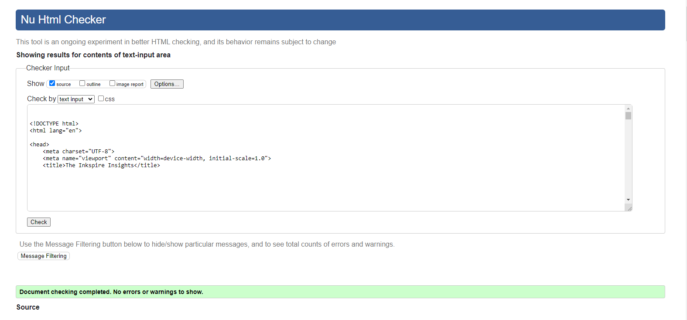

# Table of Contents

- [User Story Testing](#user-story-testing)
- [Code Validation](#code-validation)
  - [HTML](#html)
  - [CSS](#css)
  - [JavaScript](#JavaScript)
  - [Python](#python)
- [Responsiveness](#Responsiveness)
- [Browser Testing](#browser-testing)
- [Device Testing](#device-testing)
- [Lighthouse](#Lighthouse)
- [Manual Testing](#manual-testing)

  - [Site Navigation](#site-navigation)
  - [Home Page](#home-page)
  - [Category Page](#category-page)
  - [Article Preview Card](#article-preview-card)
  - [Post Detail Page](#post-detail-page)
  - [Comment](#comment)
  - [Add Post Page](#add-post-page)
  - [Edit Post Page](#edit-post-page)
  - [Delete Confirmation Modal](#delete-confirmation-modal)
  - [Profile Page](#profile-page)
  - [Update Profile Page](#update-profile-page)
  - [Sign Up Page](#sign-up-page)
  - [Sign In Page](#sign-in-page)
  - [Log Out Page](#log-out-page)
  - [Code of Conduct Page](#code-of-conduct-page)

- [Bugs](#bugs)

## User Story Testing

### Developer Stories

| User Story                                                                                  | Screenshot                                                   | Result           |
| ------------------------------------------------------------------------------------------- | ------------------------------------------------------------ | ---------------- |
| As a developer I can setup a new Django project                                              | The project was set up successfully                           | <mark>PASS</mark> |
| As a developer I can connect database and media storage                                      | Database and storage set up successfully                      | <mark>PASS</mark> |
| As a developer, I can perform an early deployment of the application                         | Live site was hosted with no errors                           | <mark>PASS</mark> |
| As a developer I can layout wireframes                                                       | Wireframes were planned and created as referenced in the README| <mark>PASS</mark> |
| As a developer I can choose a colour theme                                                   | A colour theme was chosen for the website as referenced in the README | <mark>PASS</mark> |

### User Stories

### Developer Stories

| User Story                                                                                  | Screenshot                                                   | Result           |
| ------------------------------------------------------------------------------------------- | ------------------------------------------------------------ | ---------------- |
| As a developer I can setup a new Django project                                              | The project was set up successfully                           | <mark>PASS</mark> |
| As a developer I can connect database and media storage                                      | Database and storage set up successfully                      | <mark>PASS</mark> |
| As a developer, I can perform an early deployment of the application                         | Live site was hosted with no errors                           | <mark>PASS</mark> |
| As a developer I can layout wireframes                                                       | Wireframes were planned and created as referenced in the [README](./README.md) | <mark>PASS</mark> |
| As a developer I can choose a colour theme                                                   | A colour theme was chosen for the website as referenced in the [Colour Sceme](./README.md#colour-scheme) | <mark>PASS</mark> |

### User Stories

| User Story                                                                                  | Screenshot                                                   | Result           |
| ------------------------------------------------------------------------------------------- | ------------------------------------------------------------ | ---------------- |
| As a user I want the website to be responsive so I can view it on multiple devices           | Responsive testing as referenced in the [Responsiveness](./README.md#responsiveness) | <mark>PASS</mark> |
| As a User I can intuitively navigate through the website                                    | Navigation Bar referenced in the [Colour Scheme](./README.md#colour-scheme) | <mark>PASS</mark> |
| As a User, I can create an account                                                          | Registration process detailed in the [Register](./README.md#user-account-pages) | <mark>PASS</mark> |
| As a User, I can access my account                                                          | Profile Edit described in the [Sign in](./README.md#user-account-pages) | <mark>PASS</mark> |
| As a User, I can log out                                                                    | Sign Out functionality detailed in the [Log out view](./README.md#user-account-pages) | <mark>PASS</mark> |
| As a User, I can view content on the home page                                              | Home Page content detailed in the [Content](./README.md#contents) | <mark>PASS</mark> |
| As a User, I can view a selected article                                                    | Post Detail Page in the [Article Preview Card ](./README.md#article-preview-card) | <mark>PASS</mark> |
| As a User, I can view comments on an article                                                | Comments functionality explained in the [Comment](./README.md#comment-card) | <mark>PASS</mark> |
| As a User, I can click on the footer contact social links                                   | Footer social links referenced in the [Footer](./README.md#footer) | <mark>PASS</mark> |

### Admin Stories

| User Story                                                                                  | Screenshot                                                   | Result           |
| ------------------------------------------------------------------------------------------- | ------------------------------------------------------------ | ---------------- |
| As a Site Owner, I can perform all CRUD operations in the admin interface                   | Admin CRUD features detailed in the [README](./README.md) | <mark>PASS</mark> |
| As a Site Owner, I can approve user-created content                                          | Approval process explained in the [README](./README.md) | <mark>PASS</mark> |
| As a Site Owner, I can delete user profiles and their content                               | User deletion process in the [README](./README.md) | <mark>PASS</mark> |
| As a Site Owner, I can manage users through the admin interface                             | Admin Content management in the [README](./README.md) | <mark>PASS</mark> |
| As a Site Owner, I can view notifications when performing CRUD operations                   | Notifications feature detailed in the [Notification](./README.md#notification-messages) | <mark>PASS</mark> |

## Code Validation

### HTML

All HTML pages were run through the [W3C HTML Validator](https://validator.w3.org/). See results in below table.

| Page            | Validator                                                                                     | Result              |
| --------------- | --------------------------------------------------------------------------------------------- | ------------------- |
| Home            | 

Inksight

                                   | <mark>ERROR</mark>   |
| Home     | 

Home
>
                            | <mark>PASS</mark>   |
| About       | 

about

                                | <mark>ERROR</mark>   |
| Sign In    | 

Sign In

                           | <mark>PASS</mark> |
| Sign Up         | 

Sign Up

                                     | <mark>PASS</mark>   |
| Log Out         | 

Log Out

                                     | <mark>PASS</mark>   |

### CSS

Test Results CSS <mark>PASS<mark>

### JavaScript

The only JS used in this project was refactored from Code Institute's I Think Therefore I Blog project into a seperate JS file.

Global bootstrap variable acheived through use of the bootstrap cdn script tag in base.html template

Test Results JS <mark>ERROR<mark>

### Python

| File     | Validator                                                                                                              | Result            |
| -------- | ---------------------------------------------------------------------------------------------------------------------- | ----------------- |
| Models   | 

Models

     | <mark>PASS</mark> |
| Views    | 

Views

       | <mark>PASS</mark> |
| Forms    | 

Forms

       | <mark>PASS</mark> |
| Urls     | 

Urls

      | <mark>PASS</mark> |
| Admin    | 

Admin

       | <mark>PASS</mark> |
| Settings | 

Settings

 | <mark>PASS</mark> |
| Views    | 

Views

       | <mark>ERROR</mark> |
| Urls    | 

Urls

       | <mark>PASS</mark> |
| Urls    | 

Urls

       | <mark>PASS</mark> |

Settings.py validation errors of line to line are as a result of the original django configuration set up and not custom code.

## Responsiveness

Throughout the development process, each page underwent testing using Google Chrome's developer tools. The approach focused on verifying that every page would seamlessly adjust to a variety of screen sizes wider than 320px, rather than being limited by predetermined, device-specific widths.

Further testing was done on a real mobile device to confirm all is working as expected.

| Device         |     Pass/Fail     |               Comment                |
| -------------- | :---------------: | :----------------------------------: |
| Oneplus nord 4 | <mark>PASS</mark> | All elements are displayed correctly |

## Browser Testing

The Website was tested on Google Chrome, Firefox, Safari and Chrome Canary browsers with no issues noted.

## Device Testing

The website was tested on a variety of devices, including Desktop, Laptop, Oneplus Nord 4, and Lenovo tablet, to ensure that it displayed well on screens of different sizes, both in portrait and landscape orientations. The website functioned as expected, and its responsive design was validated using Chrome developer tools on various devices, ensuring that the layout remained structurally sound across different screen dimensions.

| Page            | Performance | Accessibility | Best Practices | SEO | Screenshot                                                                                                                  |
| --------------- | :---------: | :-----------: | :------------: | :-: | --------------------------------------------------------------------------------------------------------------------------- |
|                 |             |               |                |     |
| **Desktop**     |             |               |                |     |
| Home            |     98      |      100      |      100       | 100 | 

Home

                    |
| Category        |     98      |      100      |      100       | 100 | 

Category

            |
| Post Detail     |     97      |      100      |      100       | 100 | 

Post Detail 

      |
| Profile         |     96      |      100      |      100       | 100 | 

Profile

              |
| Add Post        |     99      |      96       |      100       | 100 | 

Add Post

             |
| Edit Post       |     99      |      96       |      100       | 100 | 

Edit Post

           |
| Update Profile  |     100     |      100      |      100       | 100 | 

Update Profile

 |
| Sign Up         |     99      |      100      |      100       | 100 | 

Sign Up

               |
| Sign In         |     100     |      100      |      100       | 100 | 

Sign In

               |
| Sign Out        |     100     |      100      |      100       | 100 | 

Sign Out

             |

## Manual Testing

### Site Navigation

| Element                | Action      | Expected Result                                         | Pass/Fail         |
| ---------------------- | ----------- | ------------------------------------------------------- | ----------------- |
| Home Link              | Click       | Redirect to Home page                                   | <mark>Pass</mark> |
| Register Link          | Click       | Redirect to sign up page                                | <mark>Pass</mark> |
| Log in Link            | Click       | Redirect to sign in page                                | <mark>Pass</mark> |
| Log out Link           | Click       | Redirect to log out page                                | <mark>Pass</mark> |
| Footer Socials         | Click       | Redirect in a new tab to all respective media platforms | <mark>Pass</mark> |
| Footer Email           | Click       | Open up an email provider with developer email attached | <mark>Pass</mark> |
| Register Link          | Display     | Render for non authenticated users                      | <mark>Pass</mark> |
| Log in Link            | Display     | Render for non authenticated users                      | <mark>Pass</mark> |
| Add Post Link          | Display     | Render only if user is authenticated                    | <mark>Pass</mark> |
| Log out Link           | Display     | Render only if user is authenticated                    | <mark>Pass</mark> |
| Nav Link               | Hover/Focus | Display a border,         | <mark>Pass</mark> |
